<div align="center">

# ⚡ Vidyut EV Charging & Autopilot Platform
### Enterprise-Grade Next-Gen EV Ecosystem for India • Connector-Aware Routing • Multi-Agent Autonomy • Live Grid Telemetry

[](https://spring.io/projects/spring-boot)
[](https://react.dev)
[](https://vitejs.dev)
[](https://ai.google.dev)
[](https://www.postgresql.org)
[](https://expo.dev)
[](http://project-osrm.org)
[](./vidyut-mobile/LICENSE)

<p align="center">
  <b>Vidyut</b> is a mission-critical EV charging and Autopilot route intelligence platform engineered for Indian highways and metropolitan clusters. Built with strict role boundaries, high-precision SoC charging-curve integration, real-road OSRM matrix routing, automated self-healing trip recovery, solar RESCO partnership workflows, and multi-tier AI execution authority.
</p>

---

</div>

> [!IMPORTANT]
> **Synthetic Demo Data Disclaimer**: District hubs (777), corridor hubs (112), charging networks, vehicle battery models, tariffs, and government scheme estimates included in the seeders are synthetic and designed for operational testing. They demonstrate production-grade workflows and are not real-world commercial station guarantees.

---

## 📑 Table of Contents

- [⚡ System Overview & Architecture](#-system-overview--architecture)
- [🤖 Three-Agent Multi-Tier AI Architecture](#-three-agent-multi-tier-ai-architecture)
- [🧩 Core Subsystems & Repository Structure](#-core-subsystems--repository-structure)
- [📊 Deep-Dive Architectural & Protocol Flowcharts](#-deep-dive-architectural--protocol-flowcharts)
  - [1. Enterprise Architecture & System Boundaries](#1-enterprise-architecture--system-boundaries)
  - [2. Natural-Language Autopilot & Multi-Tier Autonomy](#2-natural-language-autopilot--multi-tier-autonomy)
  - [3. Dynamic Road Intelligence & Resilient Fallback Engine](#3-dynamic-road-intelligence--resilient-fallback-engine)
  - [4. Live Ongoing Journey & Self-Healing Charger Recovery Protocol](#4-live-ongoing-journey--self-healing-charger-recovery-protocol)
  - [5. Host-to-Company Marketplace & Solar RESCO Lifecycle](#5-host-to-company-marketplace--solar-resco-lifecycle)
  - [6. High-Precision Charging Session State Machine](#6-high-precision-charging-session-state-machine)
  - [7. Charger Fault, Tamper & Grid Telemetry Architecture](#7-charger-fault-tamper--grid-telemetry-architecture)
  - [8. Principle of Least Privilege Admin Governance Engine](#8-principle-of-least-privilege-admin-governance-engine)
  - [9. RBAC & AI Execution Authority Boundaries](#9-rbac--ai-execution-authority-boundaries)
  - [10. Relational Entity-Relationship Model & Telemetry Schema](#10-relational-entity-relationship-model--telemetry-schema)
- [📡 Binary Protocols, Telemetry & Frame Schemas](#-binary-protocols-telemetry--frame-schemas)
- [🎛️ Implemented Workspaces & Cockpits](#️-implemented-workspaces--cockpits)
- [🚀 Quickstart & Concurrent Launch](#-quickstart--concurrent-launch)
- [🧪 Comprehensive Verification & Test Suite](#-comprehensive-verification--test-suite)
- [🗺️ API Surface Reference](#️-api-surface-reference)

---

## ⚡ System Overview & Architecture

Vidyut orchestrates four distinct stakeholders through dedicated role-scoped cockpits powered by a unified event-driven backend:

```text
┌────────────────────────────────────────────────────────────────────────────────────────┐
│                                 ROLE-SCOPED COCKPITS                                    │
│   ┌────────────────┐   ┌─────────────────┐   ┌────────────────┐   ┌────────────────┐   │
│   │ 🚗 EV Owner    │   │ 🏢 Property Host│   │ ⚡ Charge Co.  │   │ 🛡️ Super Admin │   │
│   │  Web & Mobile  │   │  Web & Mobile   │   │  Web & Mobile  │   │  Admin Portal  │   │
│   └───────┬────────┘   └────────┬────────┘   └───────┬────────┘   └───────┬────────┘   │
└───────────┼─────────────────────┼────────────────────┼────────────────────┼────────────┘
            │                     │ mode-scoped JWT    │                    │
            ▼                     ▼                    ▼                    ▼
┌────────────────────────────────────────────────────────────────────────────────────────┐
│                        SPRING BOOT 3.3.7 DOMAIN API GATEWAY                            │
│  ├── 🔐 Identity & Auth (RBAC / JWT / Account State)                                   │
│  ├── 🧠 Autopilot Engine (NLP Intent / SoC Curves / Multi-Stop Matrix Optimization)   │
│  ├── ⚡ Live Charging & Reservations (OCPP 1.6J/2.0.1 bridge / Telemetry / Refunds)    │
│  ├── 🤝 Marketplace & RESCO (Property Proposals / Surveys / Capex & Payout Models)    │
│  └── 🛡️ Governance & Auditing (Least-Disruptive Scoped Controls / Immutable Logs)       │
└───────────┬──────────────────────────────────────────┬────────────────────┬────────────┘
            │                                          │                    │
            ▼                                          ▼                    ▼
┌───────────────────────┐                  ┌──────────────────────┐ ┌────────────────────┐
│   POSTGRESQL 15 DB    │                  │  OSRM ROUTE ENGINE   │ │ PYTHON ADK AGENT   │
│  • Accounts & Garage  │                  │  • Primary OSRM      │ │  • Gemini 1.5 Pro  │
│  • Stations & Sockets │                  │  • Reference Mirror  │ │  • OpenRouter      │
│  • Active Sessions    │                  │  • 1.3x Geo Fallback │ │  • Scoped Tools    │
└───────────────────────┘                  └──────────────────────┘ └────────────────────┘
```

---

## 🤖 Three-Agent Multi-Tier AI Architecture

Vidyut employs a **tri-agent decoupled architecture** where distinct specialized AI agents operate with domain-scoped context, cryptographic security boundaries, and graduated action policies:

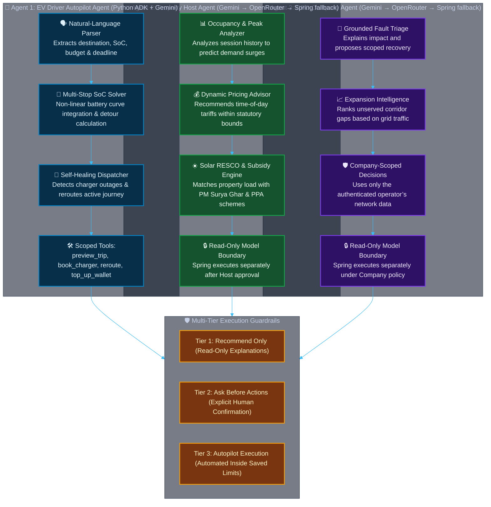

### 🔍 Tri-Agent Responsibility Matrix

| Metric / Dimension | 🚗 Agent 1: EV Autopilot Agent | 🏢 Agent 2: Host Copilot | ⚡ Agent 3: CPO & Admin Copilot |
| :--- | :--- | :--- | :--- |
| **Primary Domain** | EV Driver Route & Charging Intelligence | Property Monetization & Green Finance | CPO Fleet Operations & Platform Governance |
| **Core Engine / Stack** | Python ADK + Gemini/OpenRouter + Spring tools | Spring analytics + Python ADK Gemini/OpenRouter explanation | Spring network analytics + Python ADK Gemini/OpenRouter explanation |
| **Input Modality** | Natural-Language Prompt + Structured UI Controls | Historical Sessions, P&L Queries, Reviews | Hardware Telemetry, Tamper Alarms, Disputes |
| **Key Scoped Tools** | `preview_autopilot_trip`, `book_charger`, `reroute`, `complete_charging` | No model tools; Spring supplies occupancy, revenue, maintenance, deal and solar context | No model tools; Spring supplies faults, pricing, revenue, expansion and offer context |
| **Autonomy Enforcement** | `Recommend` \| `Ask Before Action` \| `Full Autopilot` | Separate approval-gated Host action endpoint | Company policy + separate ownership/approval-checked action endpoint |
| **Fault Resilience** | Autonomous in-flight rerouting upon socket failure | Gemini → OpenRouter → deterministic Host answer | Gemini → OpenRouter → deterministic Company answer |

---

## 🧩 Core Subsystems & Repository Structure

| Module | Core Stack | Purpose & Responsibility |
| :--- | :--- | :--- |
| [`vidyut-backend`](./vidyut-backend) | **Java 17, Spring Boot 3.3.7, PostgreSQL, Flyway, JWT** | High-throughput transactional core: RBAC, Autopilot engine, dynamic OSRM routing, OCPP session state machines, marketplace negotiations, wallets, payments, and tamper governance. |
| [`vidyut-web`](./vidyut-web) | **React 19, TypeScript 6, Vite 8, Leaflet, Tailwind/Vanilla** | Reactive web suite featuring high-performance dashboards for EV Drivers, Property Hosts, ChargePoint Operators (CPO), and Platform Admins. |
| [`vidyut-ai/agent`](./vidyut-ai/agent) | **Python 3.10+, Google GenAI ADK, FastAPI, OpenRouter** | Natural language reasoning agent equipped with authenticated backend tool hooks, safe fallback mechanics, and strict confirmation boundaries. |
| [`vidyut-mobile`](./vidyut-mobile) | **React Native 0.86, Expo 57, Expo Router** | Cross-platform iOS/Android app featuring BLE charger handshake, offline cached corridors, real-time telemetry, and biometric authentication. |

---

## 📊 Deep-Dive Architectural & Protocol Flowcharts

### 1. Enterprise Architecture & System Boundaries

This diagram visualizes role isolation, micro-domain communication, and real-time data streaming across the platform ecosystem.

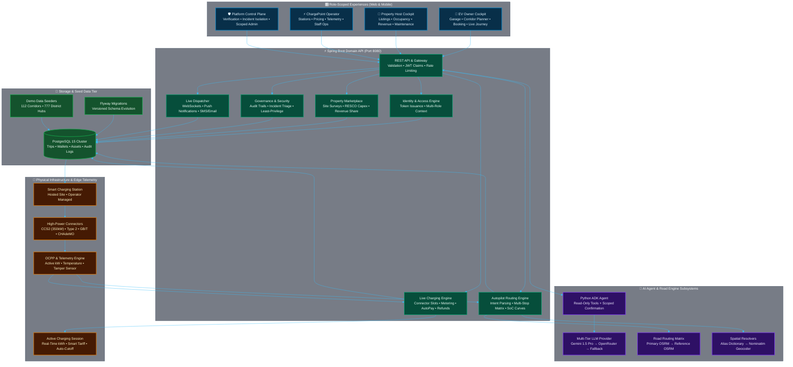

---

### 2. Natural-Language Autopilot & Multi-Tier Autonomy

The system merges natural-language trip parameters with hard vehicle battery constraints, evaluates multi-stop route feasibility, and routes through explicit execution authority levels.

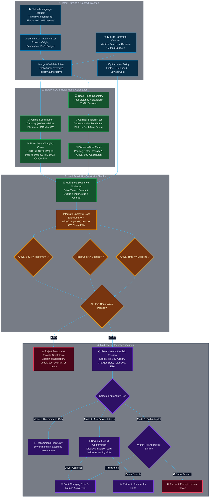

---

### 3. Dynamic Road Intelligence & Resilient Fallback Engine

When public routing providers suffer network degradation, Vidyut automatically shifts into safe fallback modes without misrepresenting estimated telemetry as verified road measurements.

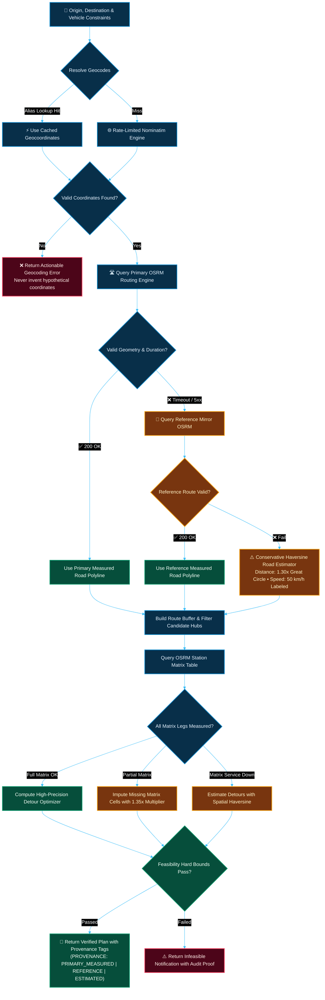

---

### 4. Live Ongoing Journey & Self-Healing Charger Recovery Protocol

This sequence diagram depicts how a live charger outage triggers automatic rerouting and slot reservation while keeping the active journey visible on the driver's dashboard for up to 72 hours.

```mermaid
%%{init: {
  "theme": "base",
  "themeVariables": {
    "darkMode": true,
    "background": "#0b0f19",
    "actorBkg": "#0f172a",
    "actorBorder": "#38bdf8",
    "actorTextColor": "#f8fafc",
    "actorLineColor": "#64748b",
    "signalColor": "#38bdf8",
    "signalTextColor": "#f8fafc",
    "labelBoxBkgColor": "#1e293b",
    "labelBoxBorderColor": "#f59e0b",
    "labelTextColor": "#fbbf24",
    "loopTextColor": "#c084fc",
    "loopLineColor": "#a855f7",
    "noteBkgColor": "#1e1b4b",
    "noteBorderColor": "#818cf8",
    "noteTextColor": "#e0e7ff",
    "activationBkgColor": "#1e293b",
    "activationBorderColor": "#10b981"
  }
}}%%
sequenceDiagram
    autonumber
    actor Driver as 🚗 EV Driver
    participant App as 📱 Vidyut Web/Mobile App
    participant API as ⚡ Vidyut Backend API
    participant Booking as 🎟️ Booking & Lock Engine
    participant Ops as 🏢 CPO Telemetry Stream
    participant Router as 🧠 Autopilot Optimizer
    participant Notify as 🔔 Push Dispatcher

    rect rgb(15, 23, 42)
    Note over Driver,App: Phase 1: Plan Confirmation & Journey Launch
    Driver->>App: Confirm Feasible Plan & Select Autopilot Authority
    App->>API: POST /api/ev/autopilot/launch-journey
    API->>Booking: Lock & Reserve Connector Slots for Planned Stops
    Booking-->>API: Slot UUIDs, Price Locks & QR Tokens
    API-->>App: Return Active Journey Payload (72h Recovery Cache)
    end

    rect rgb(6, 78, 59)
    Note over App,Ops: Phase 2: Live Telemetry & Session Monitoring
    loop Every 10 Seconds Active Telemetry
        Ops-->>API: Broadcast Socket Health, Temperature & Real-Time Queue
        API-->>App: Push Live Progress, SoC Trend & Updated ETA
    end
    end

    rect rgb(76, 5, 25)
    Note over Ops,Notify: Phase 3: Hardware Outage & Autonomous Self-Healing
    Ops->>API: 🚨 ALERT: Reserved Charger Enters FAULT / MAINTENANCE
    API->>Booking: Release Unusable Future Reservation & Protect Session State
    API->>Router: Execute Emergency Replacement Search (SoC, Connector, Budget)
    Router->>Router: Validate Detour Constraints, Elevation & Charging Curves
    Router-->>API: Feasible Replacement Station Identified (Detour +4km, +6 min)
    end

    alt Autonomy: Full Autopilot (Within Saved Tolerances)
        API->>Booking: Automatically Lock Replacement Charger Slot
        API-->>App: Push Real-Time Reroute & Updated Route Polyline
        API->>Notify: Dispatch Immediate In-App Audio & Notification Alert
        Notify-->>Driver: 'Charger Fault: Automatically Rerouted to Station B (+6 min)'
    else Autonomy: Ask Before Actions
        API-->>App: Emit Critical Action Prompt (Show Time & Cost Delta)
        Driver->>App: Tap 'Approve Reroute to Station B'
        App->>API: POST /api/ev/autopilot/confirm-reroute
        API->>Booking: Finalize Slot Lock on Replacement Station
    else Autonomy: Recommend Only
        API-->>App: Display Advisory Alert & Show Alternative Stations on Map
    end
```

---

### 5. Host-to-Company Marketplace & Solar RESCO Lifecycle

The end-to-end commercial lifecycle for property owners onboarding sites, negotiating capex/opex with charging operators, and deploying clean solar infrastructure.

```mermaid
%%{init: {
  "theme": "base",
  "themeVariables": {
    "darkMode": true,
    "background": "#0b0f19",
    "primaryColor": "#111827",
    "primaryTextColor": "#f8fafc",
    "primaryBorderColor": "#0ea5e9",
    "lineColor": "#38bdf8",
    "clusterBkg": "#0f172a90",
    "clusterBorder": "#334155",
    "fontFamily": "Inter, sans-serif"
  }
}}%%
flowchart TD
    subgraph S1["1. Host Property Onboarding"]
        H_LIST["🏢 Host Creates Property Listing<br/>Location, Parking Bays, Electrical Sanction Load"]
        H_DOCS["📄 Upload Ownership & Grid Proof<br/>Property Deed, Electricity Bill, Geotagged Photos"]
        H_LIST --> H_DOCS
    end

    subgraph S2["2. Admin Verification & Publishing"]
        ADM_REV["🛡️ Admin Compliance Audit<br/>Verify Title, Grid Capacity, Physical Video Survey"]
        ADM_DEC{"Site Meets Safety Criteria?"}
        ADM_DOCS_REQ["Request Clarifications / Site Rectification"]
        ADM_PUB["🚀 Publish Property to Operator Marketplace<br/>(Ownership Remains with Host)"]
        
        H_DOCS --> ADM_REV --> ADM_DEC
        ADM_DEC -->|❌ No| ADM_DOCS_REQ --> H_DOCS
        ADM_DEC -->|✅ Yes| ADM_PUB
    end

    subgraph S3["3. CPO Discovery & Commercial Agreement"]
        CPO_DISC["⚡ CPO Discovers Published Opportunity"]
        CPO_SURVEY["📐 Request Physical / Video Feasibility Survey"]
        CPO_PROP["💼 Submit Joint Venture Proposal<br/>Charger Mix (CCS2/AC), Capex Split, Revenue Share %"]
        H_REVIEW{"Host Commercial Review"}
        H_NEG["Negotiate Terms / Revision Request"]
        PROJ_CREATE["🤝 Execute Digital Agreement & Create Project<br/>(Operator Owns Asset • Host Owns Land)"]
        
        ADM_PUB --> CPO_DISC --> CPO_SURVEY --> CPO_PROP --> H_REVIEW
        H_REVIEW -->|❌ Counter Offer| H_NEG --> CPO_PROP
        H_REVIEW -->|✅ Accepted| PROJ_CREATE
    end

    subgraph S4["4. Commissioning, Live Operations & Solar Expansion"]
        DEPLOY["🔧 Civil Works, Grid Interconnect & Charger Commissioning"]
        GO_LIVE["🟢 Station Goes Live on Vidyut Network"]
        MONITOR["📊 Live Telemetry, Revenue Split & Dynamic Pricing"]
        SOLAR_EVAL["☀️ Solar RESCO Feasibility Engine<br/>Rooftop Solar + Battery Energy Storage (BESS) Assessment"]
        SOLAR_PROP["🌱 Apply for Green Energy Open Access & Subsidies"]
        
        PROJ_CREATE --> DEPLOY --> GO_LIVE --> MONITOR
        MONITOR --> SOLAR_EVAL --> SOLAR_PROP
    end

    classDef host fill:#082f49,stroke:#0284c7,color:#e0f2fe,stroke-width:2px;
    classDef admin fill:#2e1065,stroke:#7c3aed,color:#ede9fe,stroke-width:2px;
    classDef cpo fill:#14532d,stroke:#16a34a,color:#f0fdf4,stroke-width:2px;
    classDef ops fill:#78350f,stroke:#f59e0b,color:#fef3c7,stroke-width:2px;

    class H_LIST,H_DOCS,H_REVIEW,H_NEG host;
    class ADM_REV,ADM_DEC,ADM_DOCS_REQ,ADM_PUB admin;
    class CPO_DISC,CPO_SURVEY,CPO_PROP,PROJ_CREATE cpo;
    class DEPLOY,GO_LIVE,MONITOR,SOLAR_EVAL,SOLAR_PROP ops;
```

---

### 6. High-Precision Charging Session State Machine

Every charging socket transitions through deterministic operational states to prevent double-booking, manage smart load balancing, and guarantee financial settlement.

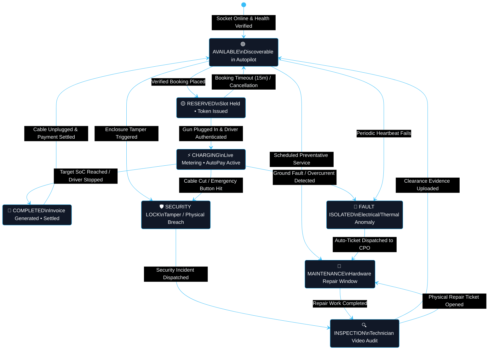

---

### 7. Charger Fault, Tamper & Grid Telemetry Architecture

Coordinated response engine that decouples hardware remediation from customer journey rerouting.

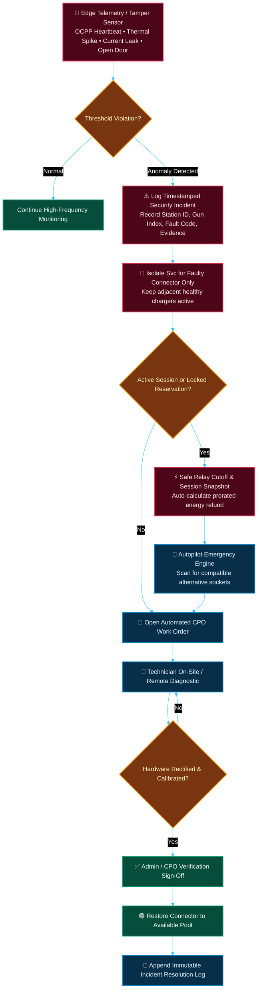

---

### 8. Principle of Least Privilege Admin Governance Engine

The platform enforces graduated operational intervention. Administrators apply asset- or capability-level restrictions before invoking identity-level suspensions.

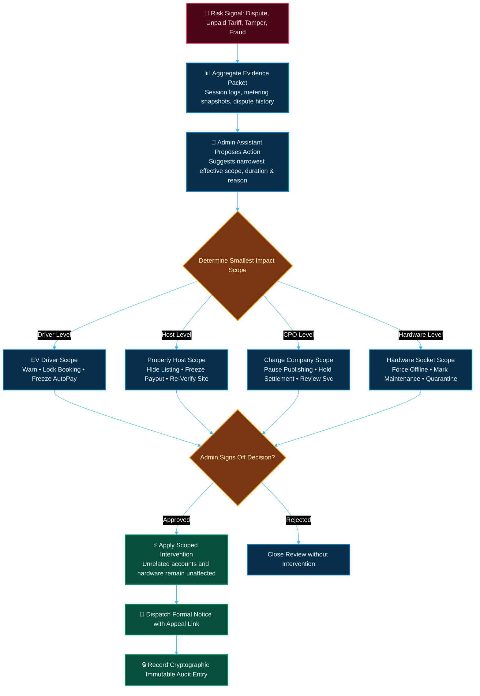

---

### 9. RBAC & AI Execution Authority Boundaries

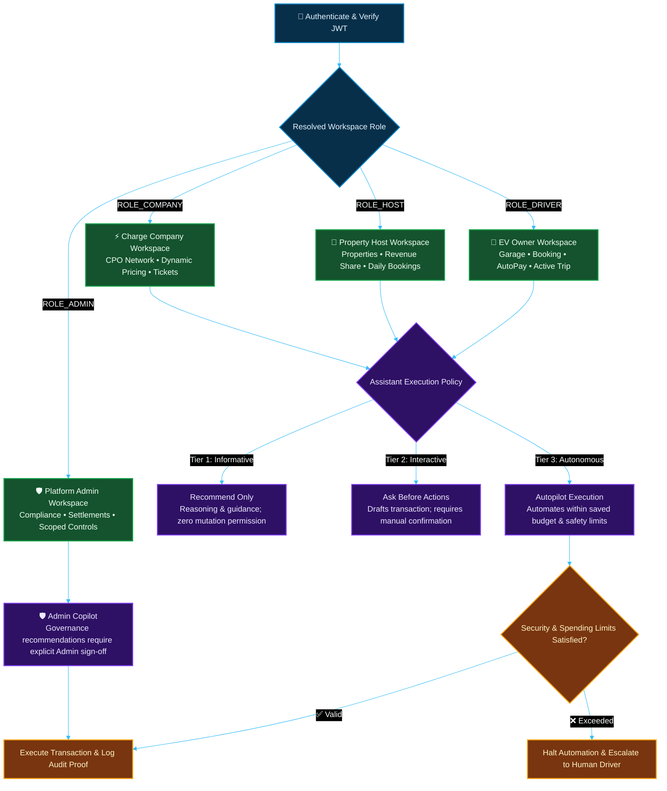

---

### 10. Relational Entity-Relationship Model & Telemetry Schema

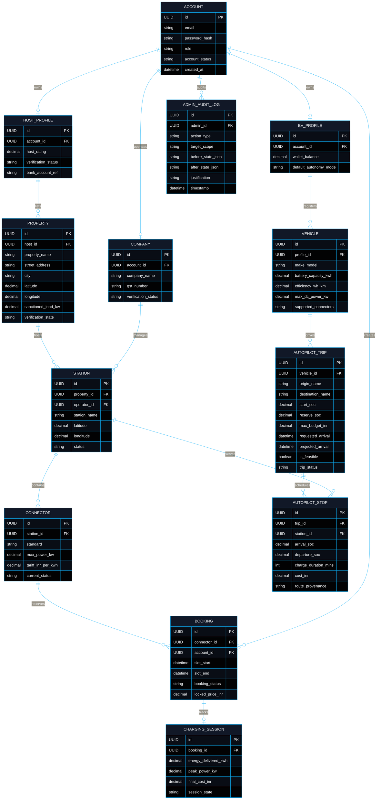

---

## 📡 Binary Protocols, Telemetry & Frame Schemas

### 1. ISO-8601 Time-Tagged Live Telemetry Frame

High-frequency socket telemetry serialized over WebSockets / MQTT for real-time Autopilot recalculations:

```json
{
  "protocol": "VIDYUT_OCPP_EXT_v2.1",
  "timestamp_utc": "2026-08-23T10:36:00.184Z",
  "station_uuid": "e6a2b851-9dc4-4d8b-b8ef-52c418f72c39",
  "socket_index": 1,
  "connector_standard": "CCS2",
  "status": "CHARGING",
  "telemetry": {
    "voltage_v": 412.8,
    "current_a": 145.3,
    "active_power_kw": 59.98,
    "gun_temperature_celsius": 38.4,
    "delivered_kwh": 24.812,
    "current_soc_percent": 68.4,
    "target_soc_percent": 80.0,
    "time_remaining_seconds": 780
  },
  "safety_mesh": {
    "ground_isolation_resistance_kohm": 940,
    "enclosure_tamper_detected": false,
    "emergency_stop_triggered": false,
    "grid_frequency_hz": 50.02
  }
}
```

### 2. Autopilot Route Optimization Constraint Payload

```json
{
  "origin": { "lat": 26.8467, "lng": 80.9462, "label": "Lucknow" },
  "destination": { "lat": 23.2599, "lng": 77.4126, "label": "Bhopal" },
  "vehicle_profile": {
    "model": "Tata Nexon EV Max",
    "usable_kwh": 40.5,
    "efficiency_wh_km": 142.0,
    "max_dc_kw": 50.0,
    "charging_loss_factor": 0.08
  },
  "constraints": {
    "initial_soc": 55.0,
    "safety_reserve_soc": 10.0,
    "max_budget_inr": 1800.00,
    "arrive_by_iso": "2026-08-23T19:30:00Z",
    "autonomy_tier": "ASK_BEFORE_ACTION",
    "optimization_mode": "FASTEST"
  }
}
```

---

## 🎛️ Implemented Workspaces & Cockpits

<details open>
<summary><b>🚗 1. EV Owner Experience</b></summary>

- **Interactive Garage**: Configure usable battery capacity, Wh/km efficiency, max DC power limits, and supported connectors.
- **Autopilot NLP Planner**: Parses queries like *"Drive my Nexon EV to Bhopal, start at 50%, arrive before 7 PM, keep ₹1,500 budget"*.
- **Vehicle Comparator**: Automatically compares garage vehicles on a route and highlights the optimal car.
- **Continuous 72h Journey Recovery**: Active road trips persist on the dashboard even across reloads or network drops.
- **Self-Healing Rerouting**: Automatic connector re-selection and booking migration upon hardware faults.
</details>

<details>
<summary><b>🏢 2. Property Host Experience</b></summary>

- **Property Onboarding**: Multi-step site submission with geotagging, electricity bill uploads, and video proof.
- **Occupancy & Demand**: Real-time socket status streaming directly from active database sessions.
- **Host Copilot**: AI-assisted revenue optimization, tariff recommendations, and maintenance scheduling.
- **Green Finance & Solar RESCO**: Financial modeling for solar PPA, capex investment, and subsidy eligibility.
</details>

<details>
<summary><b>⚡ 3. ChargePoint Operator (CPO) Experience</b></summary>

- **Network Control Room**: Monitor station status, fault codes, live queues, and charging curves.
- **Granular Maintenance Isolation**: Isolate a faulty connector without taking the entire multi-gun station offline.
- **Expansion Intelligence**: Read-only grid analytics ranking top high-potential sites based on power readiness and route traffic.
- **Dynamic Tariffing**: Configurable time-of-day and congestion pricing models.
</details>

<details>
<summary><b>🛡️ 4. Admin Governance & Control Plane</b></summary>

- **Capability-Scoped RBAC**: Fine-grained administrator boundaries (Verification Admin, Settlement Admin, Super Admin).
- **Graduated Scoped Interventions**: Restrict specific sockets, listings, or capabilities before identity suspension.
- **Immutable Cryptographic Audit Trail**: Every administrative action logs actor, before/after JSON states, and justifications.
- **Network AI Memory**: Platform-wide intelligence tracking route outcomes and incident resolution times.
</details>

---

## 🚀 Quickstart & Concurrent Launch

### Prerequisites

| Tool | Recommended Version |
| :--- | :--- |
| **Java JDK** | OpenJDK 17 LTS or higher |
| **Node.js** | Node.js 18 LTS+ (with npm 9+) |
| **Python** | Python 3.10 or 3.11 |
| **PostgreSQL** | PostgreSQL 15+ |
| **Docker** (Optional) | For running the local OSRM routing container |

---

### One-Command Concurrent Launch

The root launcher boots the `vidyut-osrm` container, compiles the Spring Boot backend, starts the FastAPI Python AI agent, and launches the Vite React frontend concurrently:

```powershell
# 1. Install root dependencies
npm install

# 2. Run all microservices concurrently
npm run dev
```

---

### Manual Step-by-Step Launch

<details>
<summary><b>Click to expand individual subsystem startup instructions</b></summary>

#### 1. Start PostgreSQL & OSRM Engine
```powershell
# Start local OSRM India router (Port 5000)
docker run -d --name vidyut-osrm -p 5000:5000 osrm/osrm-backend osrm-routed --algorithm mld /data/india-latest.osrm
```

#### 2. Launch Spring Boot Domain API (Port 8080)
```powershell
cd vidyut-backend
$env:SPRING_DATASOURCE_URL = "jdbc:postgresql://localhost:5432/vidyut_db"
$env:SPRING_DATASOURCE_USERNAME = "postgres"
$env:SPRING_DATASOURCE_PASSWORD = "your_postgres_password"
mvn spring-boot:run
```

#### 3. Launch Python ADK AI Agent (Port 8001)
```powershell
cd vidyut-ai\agent
.\.venv\Scripts\Activate.ps1
pip install -r requirements.txt
$env:GOOGLE_API_KEY = "your_gemini_api_key"
python -m vidyut_agent
```

#### 4. Launch React 19 Web Cockpit (Port 5173)
```powershell
cd vidyut-web
npm install
npm run dev
```

#### 5. Launch Mobile Application (Expo 57)
```powershell
cd vidyut-mobile
npm install
npm run android
```

</details>

---

### Local Endpoint Directory

| Microservice | Protocol | Local URL |
| :--- | :--- | :--- |
| **Backend REST API** | `HTTP / JSON` | `http://localhost:8080/api` |
| **Swagger / OpenAPI** | `HTTP / HTML` | `http://localhost:8080/swagger-ui.html` |
| **Web App Cockpit** | `HTTP / SPA` | `http://localhost:5173` |
| **Python ADK Agent** | `HTTP / FastMCP` | `http://127.0.0.1:8001` |
| **OSRM Route Server** | `HTTP / OSRM` | `http://localhost:5000` |

---

### Taskmaster fault-recovery demo

Use one `FULL_AUTOPILOT` journey for the submission recording:

1. Sign in as the seeded EV Owner and build a feasible Lucknow/Kanpur-to-Bhopal trip.
2. Confirm the plan and start journey monitoring.
3. Select **Simulate charger fault** in Journey controls.
4. Verify the EV timeline shows the old booking released, a compatible replacement reserved, the route updated, and **Operations incident propagated**.
5. Refresh the Company workspace and verify the maintenance ticket and faulted connector.
6. Refresh Admin → Network operations and verify the incident.
7. Open Admin → Audit trail and verify `AUTOPILOT INCIDENT DETECTED` with actor `SYSTEM AGENT`.

The simulation is a single backend transaction: connector health changes to `FAULT`, Autopilot applies the saved autonomy policy, the booking and route are recovered, the Company work order is created, Host/Company notifications are stored, and Admin receives incident plus audit evidence. `ASK_BEFORE_ACTIONS` prepares the replacement but cannot reserve it until the driver approves; only `FULL_AUTOPILOT` executes the replacement automatically.

---

## 🧪 Comprehensive Verification & Test Suite

Run full automated test verification across all platform modules:

```powershell
# From the repository root
.\scripts\verify.ps1
```

The script runs the Spring suite, Python agent suite, web lint and production web build. Equivalent individual commands are below.

```powershell
# 1. Backend: 19 unit & integration test suites with Flyway migration checks
cd vidyut-backend
mvn test

# 2. Python AI Agent: Tool calling, provider fallback & token limit unit tests
cd ..\vidyut-ai\agent
.\.venv\Scripts\python -m unittest discover -s tests -v

# 3. Web Client: TypeScript verification, ESLint, and production Vite bundle
cd ..\..\vidyut-web
npm run lint
npm run build

# 4. Mobile Client: Typecheck & Expo manifest validation
cd ..\vidyut-mobile
npm run typecheck
npx expo config --type public
```

---

## 🗺️ API Surface Reference

```text
/api/auth/**                 -> JWT Token Issuance, Google OAuth, Role Provisioning
/api/ev/autopilot/**         -> NLP Journey Parsing, Multi-Stop Matrix Optimization, Reroute Engine
/api/ev/vehicles/**          -> Garage Management, Non-Linear SoC Curves, Connector Specs
/api/ev/bookings/**          -> Real-Time Connector Locks, Payment Gateways & QR Verification
/api/ev/payments/**          -> Wallet Ledger, AutoPay Thresholds, Prorated Refund Engine
/api/routing/**              -> Raw OSRM Road Geometry, Elevation Profiles & Haversine Fallbacks
/api/host/**                 -> Property Listings, Bank Accounts, Occupancy & Daily Earnings
/api/host/marketplace/**     -> CPO Discovery, Site Feasibility Surveys, Capex Proposals
/api/company/**              -> CPO Stations, Socket Health, Dispatch Tickets & Dynamic Pricing
/api/company/marketplace/**  -> Hardware Product Approvals, Site Ranking & Expansion Intel
/api/admin/auth/**           -> Isolated Super Admin Authentication
/api/admin/portal/**         -> Scoped Restrictions, Platform Audit Logs, Incident Mediation
```

---

<div align="center">

**Built with ❤️&⚡for the Future of Sustainable Indian Mobility**

*Vidyut EV Platform • Enterprise Architecture Reference*

</div>
