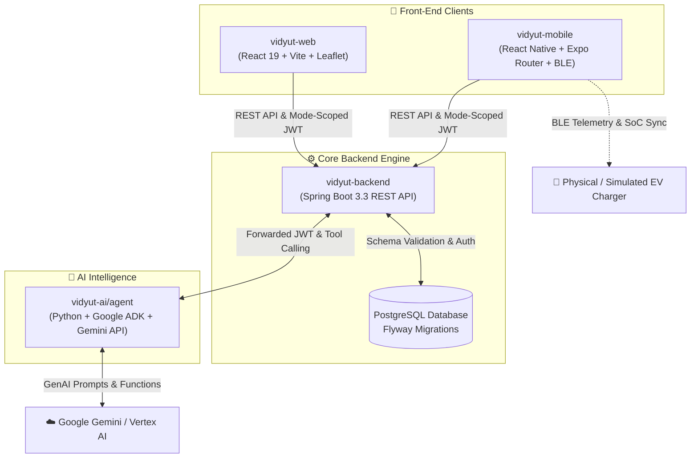
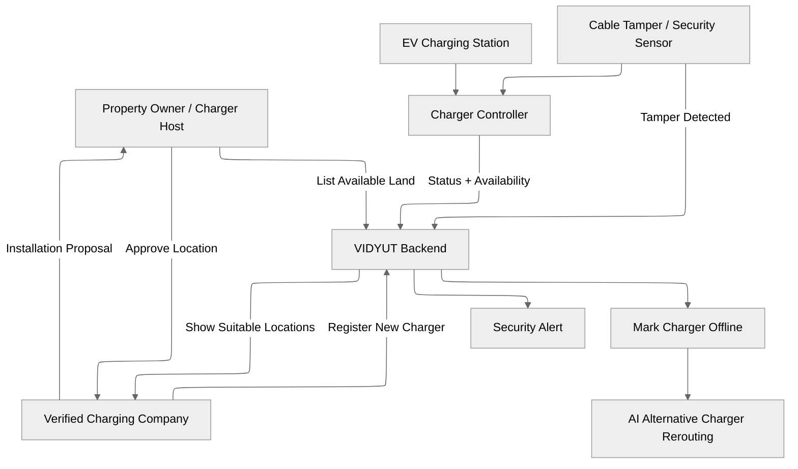

# ⚡ Vidyut — AI-Powered P2P EV Charging Platform

> **An intelligent, peer-to-peer EV charging marketplace and AI-assisted route planning ecosystem built for seamless electric mobility.**

[](https://spring.io/projects/spring-boot)
[](https://react.dev/)
[](https://reactnative.dev/)
[](https://expo.dev/)
[](https://www.python.org/)
[](https://aistudio.google.com/)
[](https://www.postgresql.org/)

---

## 📌 Overview

**Vidyut** connects EV drivers with peer-to-peer charging hosts, institutional station networks, and AI-powered trip planning intelligence. Designed as a full-stack platform, Vidyut addresses range anxiety, station availability bottlenecks, and charging infrastructure fragmentation through real-time telemetry, automated station diversion, and intelligent multi-stop trip optimization.

### Key Capabilities

* 🚗 **AI Autopilot Trip Planner**: Real-time multi-stop EV route optimization, automatic battery range ring projection, one-tap station diversion with fee-free transfers, and proactive replanning.
* ⚡ **Peer-to-Peer & Institutional Marketplace**: Monetize personal charging outlets or institutional hubs (e.g., universities, corporate campuses) with tiered pricing (Faculty/Student/Visitor).
* 📡 **Direct Charger Telemetry via BLE**: Real-time 30-second State of Charge (SoC) synchronization over Bluetooth Low Energy with live session controls and telemetry validation.
* 🔐 **Secure & Partitioned Architecture**: PostgreSQL-enforced role partition model (Individual EV/Host accounts vs. Company and Admin accounts) with mode-scoped JWT session switching.
* 📲 **Cross-Platform Mobile & Web**: Modern React 19 web dashboard alongside a feature-packed React Native / Expo Router mobile experience with offline charging discovery and push notifications.

---

## 🏗️ Architecture

The Vidyut platform operates as a cohesive monorepo composed of four specialized core services:



### 🔄 Land Partner, Charger Security & AI Rerouting Workflow



---

## 📦 Subsystem Breakdown

| Module | Tech Stack | Description |
| :--- | :--- | :--- |
| **[vidyut-backend](file:///c:/Users/Priyanshu%20Sharma/Desktop/app/ev_charger_app/vidyut-backend)** | Spring Boot 3.3, Java 17, PostgreSQL, JPA/Hibernate, Flyway, JWT | Core REST API for user authentication, mode switching, charging sessions, wallet transactions, dynamic tier pricing, and station booking. |
| **[vidyut-web](file:///c:/Users/Priyanshu%20Sharma/Desktop/app/ev_charger_app/vidyut-web)** | React 19, TypeScript, Vite, Leaflet, Google Auth, Lucide | Responsive web dashboard featuring interactive map views, station management, account settings, and live trip previewing. |
| **[vidyut-mobile](file:///c:/Users/Priyanshu%20Sharma/Desktop/app/ev_charger_app/vidyut-mobile)** | React Native, Expo Router, TypeScript, BLE (`react-native-ble-plx`), TanStack Query, Zustand | Mobile app for iOS/Android with live BLE charger pairing, SoC telemetry sync, offline caching, push notifications, and QR scanning. |
| **[vidyut-ai/agent](file:///c:/Users/Priyanshu%20Sharma/Desktop/app/ev_charger_app/vidyut-ai/agent)** | Python 3.10+, Google GenAI SDK, Google ADK, Gemini 3.5 Flash | AI Autopilot agent providing natural language trip routing, timing scores, stop swap suggestions, delay simulation, and automated multi-stop reservations. |

---

## 🚀 Quick Start & Development

### Prerequisites

Ensure you have the following installed on your development machine:
- **Java OpenJDK 17+** & **Apache Maven 3.8+**
- **Node.js 18+** & **npm 9+**
- **Python 3.10+**
- **PostgreSQL 15+** running locally (or via Docker)

---

### Option A: One-Command Concurrent Launch ⚡

You can launch the backend API, web frontend, and AI agent simultaneously from the repository root:

```powershell
npm run dev
```

*Note: Ensure your PostgreSQL service is running and configured beforehand.*

---

### Option B: Manual Service Startup 🛠️

#### 1. Backend API (`vidyut-backend`)

```powershell
cd vidyut-backend

# Set your PostgreSQL password (and optional database parameters)
$env:SPRING_DATASOURCE_PASSWORD = "your_postgres_password"

# Run Spring Boot server (listens on http://localhost:8080)
mvn spring-boot:run
```

*Optional Environment Variables:*
- `SPRING_DATASOURCE_URL` (default: `jdbc:postgresql://localhost:5432/vidyut_db`)
- `SPRING_DATASOURCE_USERNAME` (default: `postgres`)
- `JWT_SECRET` (required for production token signing)

#### 2. AI Autopilot Agent (`vidyut-ai/agent`)

```powershell
cd vidyut-ai\agent

# Activate virtual environment
.\.venv\Scripts\Activate.ps1

# Install requirements
pip install -r requirements.txt

# Configure environment key
$env:GOOGLE_API_KEY = "your_gemini_api_key"
$env:VIDYUT_AGENT_MODEL = "gemini-3.5-flash"
$env:VIDYUT_BACKEND_BASE_URL = "http://localhost:8080"

# Start agent service (listens on http://127.0.0.1:8001)
python -m vidyut_agent
```

#### 3. Web Client (`vidyut-web`)

```powershell
cd vidyut-web

# Install dependencies
npm install

# Start Vite development server (listens on http://localhost:5173)
npm run dev
```

#### 4. Mobile App (`vidyut-mobile`)

```powershell
cd vidyut-mobile

# Install dependencies
npm install

# Start Metro bundler for Android
npm run android

# Or start Metro bundler for iOS (macOS required)
npm run ios
```

*Mobile Connection Tip:*
- **Android Emulator**: Uses `http://10.0.2.2:8080/api` by default.
- **iOS Simulator**: Uses `http://localhost:8080/api`.
- **Physical Device**: Create `.env.local` inside `vidyut-mobile/` and set `EXPO_PUBLIC_API_BASE_URL` to your development PC's local network IP (e.g., `http://192.168.1.50:8080/api`).


## 🧪 Verification & Testing Suite

Execute the full system verification suite across all components with the following commands:

```powershell
# 1. Test Backend REST API & DB Constraints
cd vidyut-backend
mvn clean test

# 2. Validate Mobile App Types & Expo Config
cd ..\vidyut-mobile
npm run typecheck
npx expo config --type public

# 3. Test AI Agent Unit Tests
cd ..\vidyut-ai\agent
.venv\Scripts\python -m unittest discover -s tests -v

# 4. Verify Web Client Production Build & Linting
cd ..\..\vidyut-web
npm run lint
npm run build
```

---

## 🔑 Account & Auth Architecture

Vidyut uses a strict PostgreSQL-backed single-account model with role-based profile partitioning:

- **Individual Accounts**: Support both `ROLE_EV_USER` and `ROLE_HOST`. Users can toggle their active mode dynamically via `POST /api/auth/switch-mode` to receive a refreshed mode-scoped JWT.
- **Company Accounts**: Bound exclusively to `ROLE_COMPANY` for fleet management and institutional station ownership.
- **Admin Accounts**: Restricted to `ROLE_ADMIN` for platform governance.

Database constraints enforced via PostgreSQL triggers ensure company and individual profiles remain mutually exclusive at transaction commit time.

---

## 📄 License & Attribution

Distributed under the MIT License. See [vidyut-mobile/LICENSE](file:///c:/Users/Priyanshu%20Sharma/Desktop/app/ev_charger_app/vidyut-mobile/LICENSE) for more information.

Built with ❤️ by the **Vidyut Development Team**.
