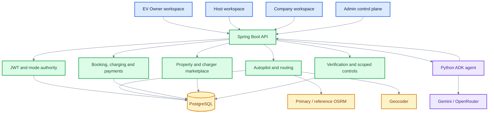
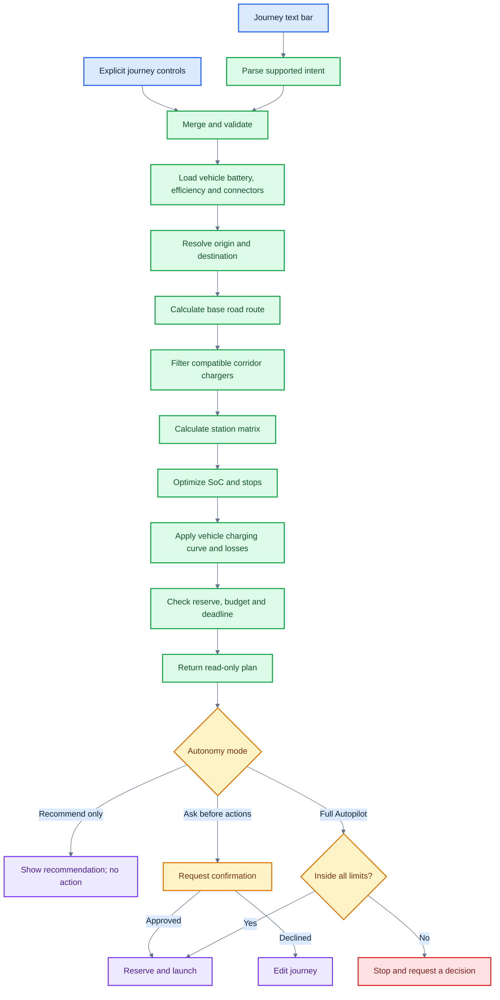
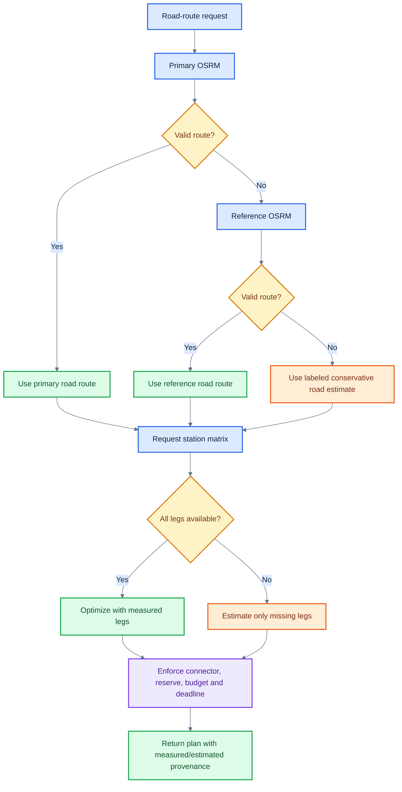
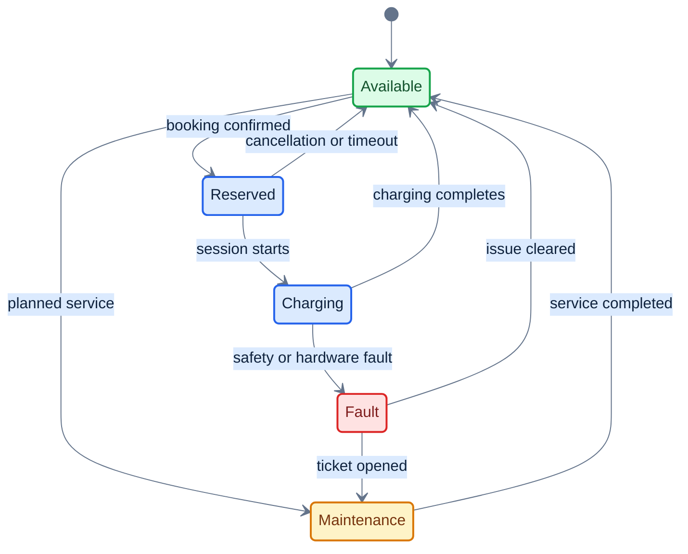
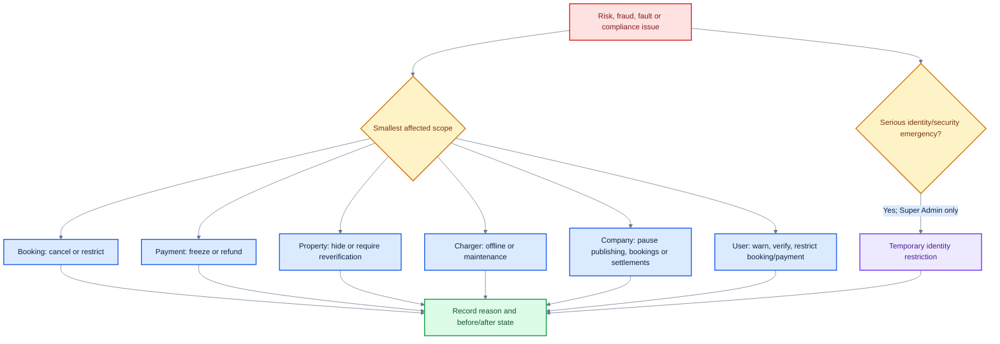
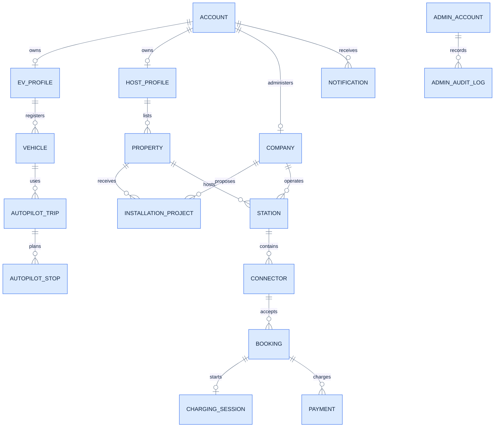

# Vidyut EV charging platform

Vidyut is a development-stage EV charging ecosystem for Indian drivers, charging Hosts, charging-network companies, and platform administrators. It combines connector-aware road-trip planning, charging and booking workflows, property-to-company partnerships, live charger operations, and scoped AI assistance.

> Important: district hubs, corridor hubs, companies, vehicles, prices, ratings, finance figures, and government-assistance leads included by the demo seeders are synthetic. They demonstrate workflows and must not be presented as verified commercial stations, offers, or scheme eligibility.

## Repository structure

| Module | Stack | Responsibility |
| --- | --- | --- |
| [`vidyut-backend`](./vidyut-backend) | Java 17, Spring Boot 3.3.7, PostgreSQL, Flyway, JWT | Authentication, role boundaries, stations, vehicles, bookings, payments, Autopilot, Host/Company/Admin operations, and demo seeders |
| [`vidyut-web`](./vidyut-web) | React 19, TypeScript 6, Vite 8, Leaflet | EV Owner, Host, Company, and separate Admin workspaces |
| [`vidyut-ai/agent`](./vidyut-ai/agent) | Python 3.10+, Google ADK, Gemini, FastAPI, OpenRouter fallback | Natural-language EV agent and backend tool orchestration |
| [`vidyut-mobile`](./vidyut-mobile) | React Native 0.86, Expo 57, Expo Router | Android/iOS owner, Host, Company, and Admin flows with BLE and offline support |

```text
Web / Mobile
     │ mode-scoped JWT
     ▼
Spring Boot API ───── PostgreSQL
     │                    │
     ├── OSRM + geocoder  ├── trips, stations, sessions
     │                    └── audit and marketplace state
     ▼
Python ADK agent ─── Gemini or OpenRouter
```

## System flow diagrams

### Platform architecture



### Natural-language Autopilot planning



### Road-route and station-matrix degradation



### Ongoing journey and charger-failure recovery

```mermaid
%%{init: {"theme":"base","themeVariables":{"actorBkg":"#dbeafe","actorBorder":"#2563eb","actorTextColor":"#10233d","signalColor":"#475569","signalTextColor":"#10233d","activationBkgColor":"#dcfce7","activationBorderColor":"#16a34a","labelBoxBkgColor":"#fef3c7","labelBoxBorderColor":"#d97706","labelTextColor":"#78350f","noteBkgColor":"#ede9fe","noteBorderColor":"#7c3aed","noteTextColor":"#4c1d95"}}}%%
sequenceDiagram
    actor Driver
    participant App as Owner dashboard
    participant API as Vidyut backend
    participant Host as Host/Company operations
    participant Router as Route optimizer

    Driver->>App: Confirm and start journey
    App->>API: Launch trip
    API-->>App: Persisted live journey and timeline
    Host->>API: Charger enters fault or maintenance
    API->>Router: Find reachable compatible replacement
    Router-->>API: Replacement, impact and new route
    alt Recommend only
        API-->>App: Explain disruption; driver acts
    else Ask before actions
        API-->>App: Request reroute approval
        Driver->>App: Approve
        App->>API: Approve reroute
    else Full Autopilot inside limits
        API->>API: Release failed reservation and reserve replacement
        API-->>App: Publish automatic reroute
    end
    App-->>Driver: Updated graph, ETA, cost and charging stop
```

### Host property to live station

```mermaid
%%{init: {"theme":"base","themeVariables":{"primaryColor":"#dcfce7","primaryTextColor":"#10233d","primaryBorderColor":"#16a34a","lineColor":"#64748b","secondaryColor":"#dbeafe","tertiaryColor":"#fef3c7"}}}%%
flowchart LR
    HOST[Host creates property] --> EVIDENCE[Ownership, electricity and site evidence]
    EVIDENCE --> ADMIN[Admin verification workflow]
    ADMIN -->|Needs information| HOST
    ADMIN -->|Verified and published| MARKET[Company property marketplace]
    MARKET --> PROFILE[Company reviews property and Host profile]
    PROFILE --> SURVEY[Request video or physical survey]
    SURVEY --> PROPOSAL[Company sends equipment proposal]
    PROPOSAL --> APPROVAL{Host approves?}
    APPROVAL -->|No| REVISE[Revise or decline]
    APPROVAL -->|Yes| INSTALL[Installation project]
    INSTALL --> LIVE[Company-operated chargers at Host property]
    LIVE --> MONITOR[Host, Company and Admin monitoring]

    classDef host fill:#dbeafe,stroke:#2563eb,color:#10233d,stroke-width:2px
    classDef governance fill:#ede9fe,stroke:#7c3aed,color:#4c1d95,stroke-width:2px
    classDef decision fill:#fef3c7,stroke:#d97706,color:#78350f,stroke-width:2px
    classDef live fill:#dcfce7,stroke:#16a34a,color:#14532d,stroke-width:2px
    classDef blocked fill:#fee2e2,stroke:#dc2626,color:#7f1d1d,stroke-width:2px
    class HOST,EVIDENCE,PROFILE,SURVEY,PROPOSAL host
    class ADMIN,MARKET governance
    class APPROVAL decision
    class INSTALL,LIVE,MONITOR live
    class REVISE blocked
```



### Charging-session state



### Least-disruptive Admin intervention



### Core data relationships



## Implemented workspaces

### EV Owner

- Connector-aware garage, including maximum AC/DC power, efficiency, charging efficiency, and supported connectors.
- Autopilot text intent parsing plus structured origin, destination, SoC, reserve, budget, deadline, trip purpose, autonomy, and optimization controls.
- Vehicle comparison that explains which owned EV is better for the selected corridor.
- Road-route preview, charging-stop selection, bookings, wallet, AutoPay, live charging, current-journey analytics, notifications, and rerouting.
- Persistent current-trip recovery: the backend exposes the latest active journey for up to `VIDYUT_AUTOPILOT_CURRENT_TRIP_MAX_AGE_HOURS` (72 hours by default).

Autonomy and optimization are independent:

| Control | Meaning |
| --- | --- |
| Recommend only | Plan and explain; never book, pay, cancel, or reroute |
| Ask before actions | Plan automatically; require confirmation before execution |
| Full Autopilot | Execute allowed operations inside the selected limits |
| Fastest | Minimize total trip time, including drive, detour, queue, setup, and charging time |
| Balanced | Balance time, cost, detour, queue, charger speed, safety, and reliability |
| Lowest cost | Minimize charging expense while preserving all hard constraints |

### Host

- Property listing and evidence workflow, email/KYC/bank verification, availability, bookings, payouts, reviews, reports, and notifications.
- Live connector occupancy derived from charging-session state rather than an AI guess.
- Host Assistant for revenue, operating hours, service priority, repair impact, alternate charging locations, company comparisons, and approval-controlled actions.
- Separate Offers & Green Finance workspace for operator comparisons, purchase/finance/RESCO solar models, and clearly labeled unverified assistance leads.
- Prince demo portfolio across Lucknow, Kanpur, Jhansi, Bhopal, and Agra, including multi-operator ownership, TATA demo chargers, a fault-ready connector, live sessions, and a solar property.

### Company

- Stations, chargers, monitoring, bookings, sessions, maintenance, pricing, analytics, revenue, settlements, staff, reports, and notifications.
- Verified Host-property discovery, complete Host/property review, saved properties, product catalogue, survey/proposal pipeline, and partnership projects.
- One Company Assistant for operational questions and permission-controlled actions.
- A separate Expansion Intelligence dashboard for read-only site ranking using grid capacity, parking readiness, and existing-network gaps.

### Admin control plane

- Separate Admin authentication and capability-scoped workspaces.
- Company, Host, property, station, charger-product, and institutional-access verification.
- Network operations, live sessions, incidents, maintenance, settlements, support, announcements, green-assistance records, AI network memory, and immutable audit history.
- Least-disruptive operational controls: restrict a capability or asset before considering emergency identity suspension.
- Independently scrollable Admin navigation so all destinations remain reachable on short screens.

## Detailed product behavior

### Journey request model

The Owner can describe a journey conversationally, fill the structured controls, or combine both. Explicitly edited fields remain visible so the driver can verify what the NLP parser understood before asking Vidyut to build a plan.

| Field | Purpose | Constraint behavior |
| --- | --- | --- |
| Vehicle | Selects battery, efficiency, connector support, and charging limits | Only compatible stations are considered |
| Origin and destination | Defines the road corridor | Resolved through the configured geocoder |
| Current battery | Energy available at departure | Must be sufficient to reach the first safe stop |
| Safety reserve | Minimum allowed SoC | Hard constraint at stops and destination |
| Maximum budget | Maximum charging spend | Hard constraint in every strategy |
| Arrive by | Requested destination clock time | Hard feasibility check when supplied |
| Trip purpose | Flexible, mall, rest/food, commute, or destination charging | Influences stop suitability and explanation |
| Autonomy | Recommend, ask first, or Full Autopilot | Controls permission to mutate state |
| Optimization | Fastest, balanced, or lowest cost | Controls how feasible candidates are ranked |

The text parser supports examples such as:

```text
Take my Tata Nexon EV from Kanpur to Bhopal.
Start at 50%, keep 10% reserve, stay under ₹1,500,
arrive by 18:30, ask before actions, and minimize total trip time.
```

The parser does not silently grant action authority. A phrase that changes the route objective cannot convert Recommend-only into Full Autopilot unless the autonomy intent is explicit and the user can see the resulting selection.

### Preview output

The read-only preview returns enough evidence to evaluate the proposal before execution:

- selected vehicle and connector compatibility;
- road distance, driving minutes, total journey minutes, and route geometry;
- route provenance: primary OSRM, reference OSRM, or conservative estimate;
- compatible chargers evaluated and selected charging sequence;
- arrival/departure SoC for every stop;
- energy added, charger rating, effective battery-side power, queue, setup, and charging minutes;
- charging cost by stop and total budget remaining;
- estimated arrival, requested arrival, deadline feasibility, and minutes late;
- independent reserve, budget, and deadline statuses plus `overallFeasible`;
- an explanation that distinguishes measured values from degraded estimates.

Recommend-only can retain this proposal without creating reservations or payment holds. Ask-before-actions displays the exact mutations awaiting approval. Full Autopilot displays the limits that bound automatic behavior.

### Vehicle recommendation

“Choose my best car” evaluates every vehicle in the signed-in garage against the same origin, destination, starting SoC, reserve, budget, deadline, and optimization strategy. The comparison includes:

- connector coverage on the corridor;
- reachable first charger and safe destination arrival;
- required number of stops;
- charging and driving time;
- expected charging spend;
- deadline feasibility;
- an explanation of why the recommended car outranks alternatives.

Priyanshu’s demo garage deliberately contains both realistic CCS2 vehicles and clearly labeled CHAdeMO, GB/T, Type 2, and Type 1 compatibility-test vehicles. The test vehicles demonstrate rejection and poor-coverage cases without assigning false connector support to a real Tata or Mahindra model.

### Ongoing journey dashboard

After confirmation, the journey remains the primary Owner view while it is active. Refreshing the application reloads the current trip rather than dropping the driver back into a blank planner. The dashboard can display:

| Area | Live information |
| --- | --- |
| Progress | current leg, completed stops, remaining distance, and ETA |
| Battery | live/current SoC, planned arrival SoC, reserve threshold, and target charge |
| Charging | active connector, effective power, energy, remaining minutes, and AutoPay state |
| Route | road polyline, current stop, next stop, compatible alternatives, and reroute state |
| Cost | held/paid charging cost, projected total, and remaining budget |
| Events | booking, departure, queue, charging, warning, fault, reroute, and completion timeline |

A charger failure is not merely a front-end animation. The backend identifies the failed connector, releases or changes affected booking state, finds a reachable compatible alternative, recalculates the remaining road route, and applies the correct autonomy rule before publishing the updated timeline.

### Lowest-cost accounting

Lowest-cost mode ranks the total journey impact rather than blindly choosing the smallest advertised ₹/kWh value:

```text
total charging journey cost
  = purchased charging energy
  + detour energy cost
  + booking and platform fees, when present
```

Extra stops can therefore lose even when their energy tariff is cheaper. Reserve, connector compatibility, reachability, station availability, maximum budget, and a hard arrival deadline remain constraints rather than optional scoring weights.

### Host operational workflow

| Host area | Implemented behavior |
| --- | --- |
| Properties | Create/edit sites, attach ownership/electricity/video evidence, track verification and publishing state |
| Companies | Compare verified operators and charger products without exposing protected contact too early |
| Installations | Request equipment, review proposals, accept/decline, and follow project milestones |
| Chargers | Show property owner separately from equipment operator; manage availability and connector state |
| Monitoring | Read occupied/available/reserved/fault state from backend sessions and connectors |
| Repair impact | Estimate affected customers, compatible alternatives, downtime, repair cost, and revenue at risk |
| Bookings | Confirm, cancel, reschedule, and track upcoming demand |
| Earnings | Daily/weekly/monthly summaries, transaction history, tax display, and verified-bank payout request |
| Reviews | Reputation score, replies, and abuse reporting |
| Assistant | Answer using the Host’s own bookings, sessions, chargers, revenue, offers, and maintenance data |
| Green finance | Compare purchase, finance, and RESCO/PPA structures with explicit eligibility disclaimers |

The Host Assistant prepares rather than fabricates external outcomes. Actions such as contacting a company, changing a charger state, opening a service request, or preparing a finance checklist are represented as approval-controlled operations with a recorded data basis.

### Company operational workflow

| Company area | Implemented behavior |
| --- | --- |
| Network | Company-owned/operated stations and connectors only |
| Live monitoring | Availability, occupied sessions, faults, load, queues, and session status |
| Maintenance | Create/update tickets and isolate a faulty connector without disabling unrelated stations |
| Property marketplace | Inspect verified property facts and the permitted Host profile before survey decisions |
| Catalogue | Submit charger products and compliance evidence for Admin approval |
| Partnerships | Track interest, survey, proposal, Host acceptance, installation, and live-station creation |
| Pricing | Update permitted station pricing and model bounded automatic changes |
| Revenue | Company revenue, payouts, settlements, and reports |
| Expansion Intelligence | Rank verified candidate sites from measurable growth evidence |
| Company Assistant | Explain or prepare operational actions within one company’s authority settings |

Company Assistant and Expansion Intelligence intentionally look and behave differently. The assistant is conversational and can have execution permission; Expansion Intelligence is a decision dashboard and cannot independently mutate the network.

### Admin governance workflow

Admin work is capability-scoped. A Verification Admin does not automatically gain settlement or Super Admin authority, and the separate Admin login cannot be reached with a normal EV/Host/Company token.

| Admin area | Typical scope |
| --- | --- |
| Command center | platform metrics and review queues |
| Accounts & staff | warnings, capability restrictions, staff roles, and exceptional identity access |
| Trust & verification | companies, representatives, banks, charger evidence, Hosts, properties, site video, and inspections |
| Network operations | stations, connectors, live sessions, incidents, maintenance, and emergency isolation |
| Marketplace control | property publishing, charger-product review, and installation oversight |
| Finance & settlements | payouts, refunds, settlement holds, and green-assistance records |
| Revenue intelligence | platform and operator trends |
| Support & notices | support cases and announcements |
| AI network control | trip outcomes, reroute performance, and route-experience memory |
| Audit trail | actor, action, resource, before/after value, reason, and timestamp |

The UI favors asset or capability intervention. For example, a cooling fault on `TATA-KNP-03` should put that connector into maintenance, notify the operator, create a ticket, and reroute affected drivers while the rest of the company network remains available.

## API surface map

The following table highlights the route groups used by the current clients. It is not a substitute for generated OpenAPI documentation.

| Route family | Main responsibilities |
| --- | --- |
| `/api/auth/**` | login, Google authentication, registration, mode switching, Host application, and profile completion |
| `/api/ev/autopilot/**` | NLP intent, vehicle ranking, previews, current trip, launch, fault recovery, reroute approval, charging completion, and experience memory |
| `/api/ev/agent/chat` | authenticated bridge to the Python agent |
| `/api/ev/vehicles/**` | garage and vehicle charging/connector profiles |
| `/api/ev/bookings/**` | Owner booking lifecycle |
| `/api/ev/payments/**` and wallet routes | payment history, holds, AutoPay, and demo top-up |
| `/api/routing/**` | direct route plans, alternatives, diversion, and status |
| `/api/host/**` | Host profile, verification, monitoring, charger state, bookings, earnings, reviews, reports, notifications, and assistant actions |
| `/api/host/marketplace/**` | company discovery, installation requests, proposals, and company interests |
| `/api/company/**` | company network, monitoring, maintenance, pricing, bookings, staff, assistant, reports, and settlements |
| `/api/company/marketplace/**` | products, verified Host opportunities, saved sites, interests, surveys, proposals, and project status |
| `/api/admin/auth/**` | isolated administrator authentication |
| `/api/admin/portal/**` | snapshot, verification workflows, scoped controls, incidents, finance, support, staff, AI query, and audit |

## Source directory guide

```text
ev_charger_app/
├── README.md
├── package.json                     # concurrent local launcher
├── vidyut-backend/
│   ├── pom.xml
│   ├── src/main/java/com/vidyut/
│   │   ├── admin/                   # Admin control plane and audit
│   │   ├── agent/                   # backend-to-agent gateway
│   │   ├── autopilot/               # intent, planning, charging and trip state
│   │   ├── auth/                    # account login and mode switching
│   │   ├── booking/ and session/    # reservations and live charging
│   │   ├── company/ and host/       # operator workspaces
│   │   ├── land/ and marketplace/   # property-company collaboration
│   │   ├── routing/                 # OSRM, geocoding and fallbacks
│   │   ├── station/ and vehicle/    # infrastructure and garage models
│   │   └── wallet/ and payment/     # financial state
│   └── src/main/resources/demo/     # synthetic corridor and district fixtures
├── vidyut-web/
│   ├── public/vidyut-logo.svg       # canonical browser SVG mark
│   └── src/components/              # Owner, Host, Company and Admin UI
├── vidyut-ai/agent/
│   ├── vidyut_agent/                # ADK service, tools and provider fallback
│   └── tests/
└── vidyut-mobile/
    ├── app/                          # Expo Router screens by authority
    └── src/features/                 # API, BLE, offline and domain modules
```

## Road routing and safe degradation

OSRM provides road geometry, duration, and the station matrix. A second OSRM URL can be configured for wider reference coverage. The selected route engine owns the complete plan: Vidyut calculates the base road polyline, filters compatible chargers near it, optimizes SoC states, and routes through only the selected stops.

Planning does not fail closed merely because a routing dependency is temporarily unavailable:

- If both road engines fail, preview uses a labeled conservative estimate: `1.30 ×` great-circle distance at `50 km/h`.
- If only station-matrix legs fail, fallback estimates are applied only to missing charger legs.
- Estimated plans retain battery, reserve, budget, connector, and deadline checks and instruct the driver to confirm live navigation before departure.

Place names are resolved through a configurable geocoder. Development defaults to public Nominatim with an in-memory cache and one-request-per-second limiter. Public Nominatim and the public OSRM demo server are not production dependencies.

## Feasibility and charging model

Overall feasibility is the conjunction of three independent checks:

```text
overall feasible = reserve feasible
                && budget feasible
                && deadline feasible
```

The API reports requested arrival, estimated arrival, available minutes, and minutes late. A battery-safe and affordable route is therefore not labeled fully feasible when it misses a requested arrival deadline.

Charging time is calculated by SoC segment, not by dividing required energy by the charger nameplate rating:

```text
battery-side power = min(
  charger rated power,
  vehicle maximum DC power,
  charging-curve power at current SoC
) × charging efficiency
```

The current default vehicle curve is full configured power from 0–60%, 80% power from 60–80%, and 40% power from 80–100%. Each vehicle can supply its own maximum power and charging efficiency.

## Demo data

Development enables idempotent synthetic seed data:

- 112 manually curated road-corridor hubs.
- 777 district hubs across 36 Indian states and union territories.
- Five station connector standards: CCS2, Type 2, CHAdeMO, GB/T, and Type 1.
- Priyanshu Sharma demo garage with Tata Nexon EV, Tata Tigor EV, Mahindra BE 6, Mahindra XEV 9e, and connector edge-case vehicles.
- Prince Host portfolio, active charging sessions, marketplace offers, repair scenarios, and solar finance examples.

See [`vidyut-backend/src/main/resources/demo/README.md`](./vidyut-backend/src/main/resources/demo/README.md) for provenance and limitations.

## Prerequisites

- Java 17 and Maven 3.8+
- Node.js 18+ and npm 9+
- Python 3.10+
- PostgreSQL 15+
- An OSRM service or an existing Docker container named `vidyut-osrm` for the root launcher

## Start the system

### Concurrent development launch

The root command starts the existing `vidyut-osrm` container and then runs the backend, web client, and AI agent:

```powershell
npm install
npm run dev
```

### Manual launch

Backend:

```powershell
cd vidyut-backend
$env:SPRING_DATASOURCE_PASSWORD = "your_postgres_password"
mvn spring-boot:run
```

AI agent:

```powershell
cd vidyut-ai\agent
.\.venv\Scripts\Activate.ps1
pip install -r requirements.txt
$env:GOOGLE_API_KEY = "your_api_key"
python -m vidyut_agent
```

Web:

```powershell
cd vidyut-web
npm install
npm run dev
```

Mobile:

```powershell
cd vidyut-mobile
npm install
npm run android
```

Default local addresses:

| Service | Address |
| --- | --- |
| Backend API | `http://localhost:8080/api` |
| Web client | `http://localhost:5173` |
| Agent | `http://127.0.0.1:8001` |
| Local OSRM | `http://localhost:5000` |

Never commit API keys, OAuth secrets, production JWT secrets, database passwords, or real identity/ownership documents. Use the supplied `.env.example` files and environment variables.

## Verification

```powershell
# Backend: 19 focused test source files plus the Spring context suite
cd vidyut-backend
mvn test

# AI agent: tool, provider-fallback, and service-fallback tests
cd ..\vidyut-ai\agent
.\.venv\Scripts\python -m unittest discover -s tests -v

# Web: lint, TypeScript, and production bundle
cd ..\..\vidyut-web
npm run lint
npm run build

# Mobile: TypeScript and resolved Expo configuration
cd ..\vidyut-mobile
npm run typecheck
npx expo config --type public
```

## Branding

The canonical web mark is [`vidyut-web/public/vidyut-logo.svg`](./vidyut-web/public/vidyut-logo.svg). It is reused for the browser favicon, splash/login/register surfaces, the main sidebar, and the Admin Portal.

## License

See [`vidyut-mobile/LICENSE`](./vidyut-mobile/LICENSE).
