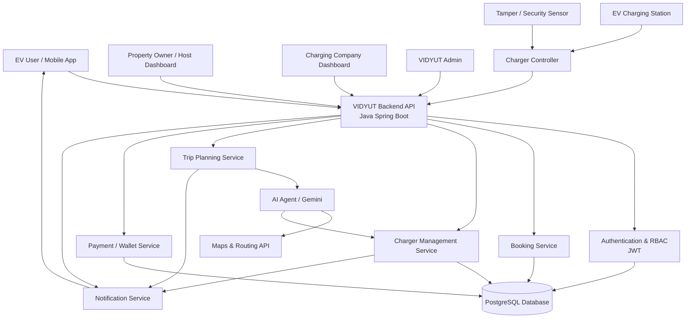
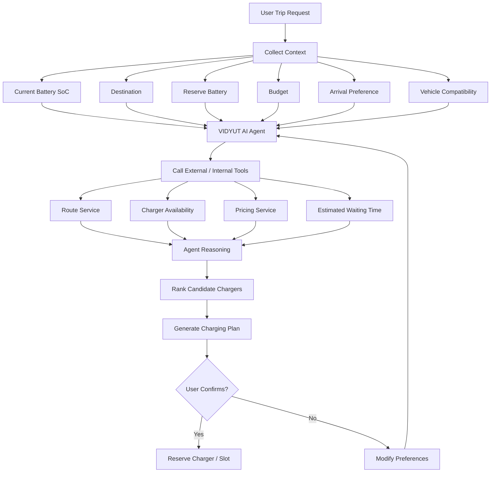
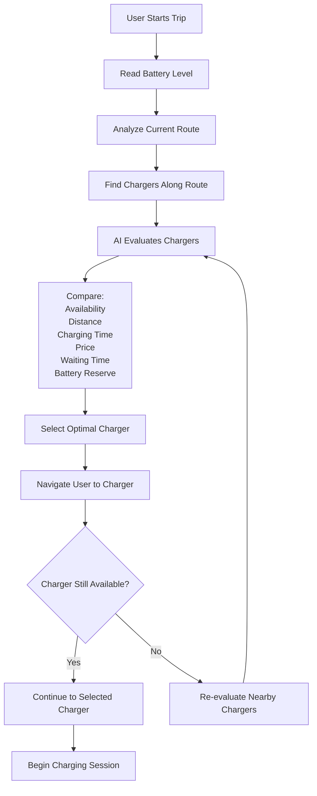
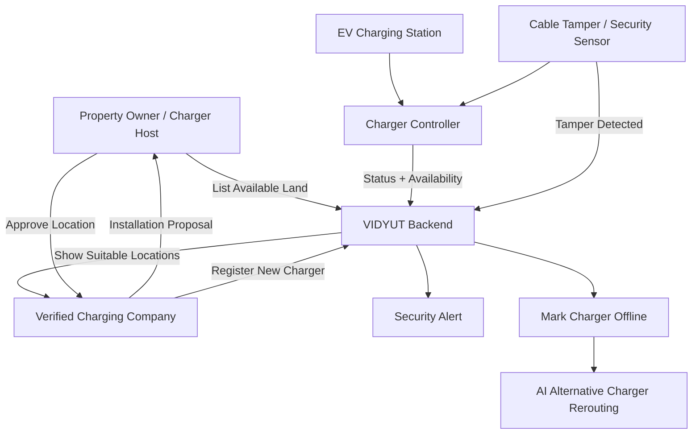
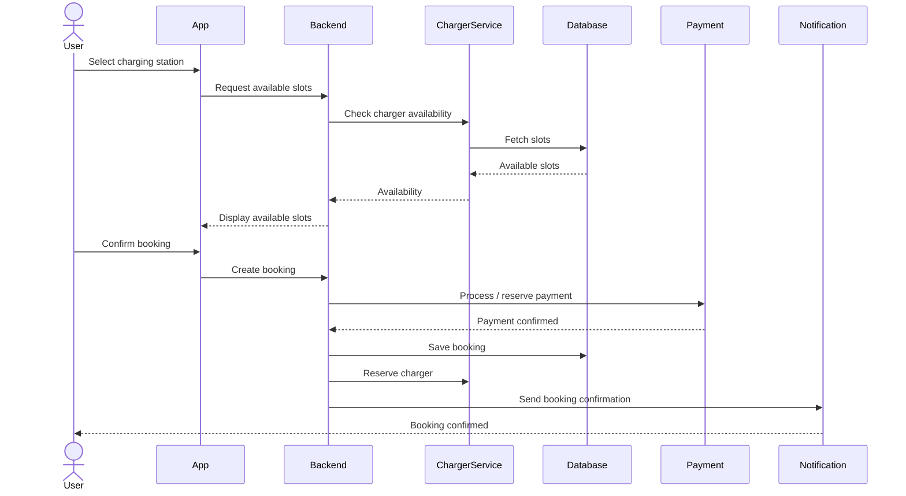
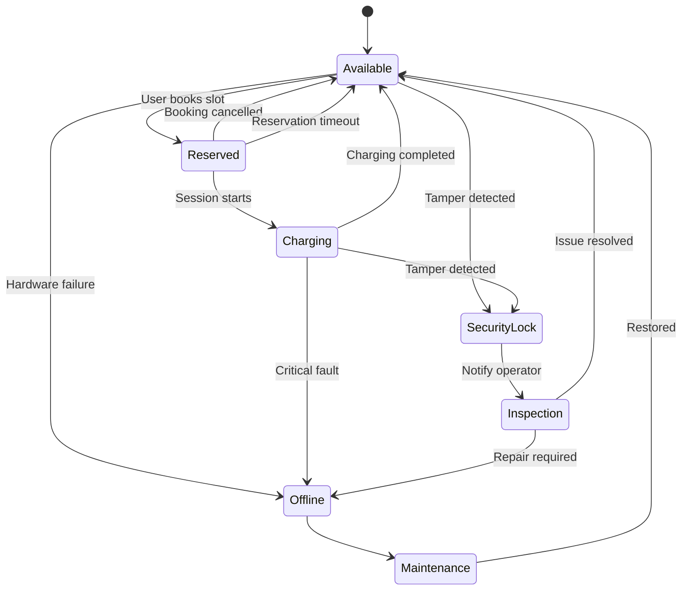
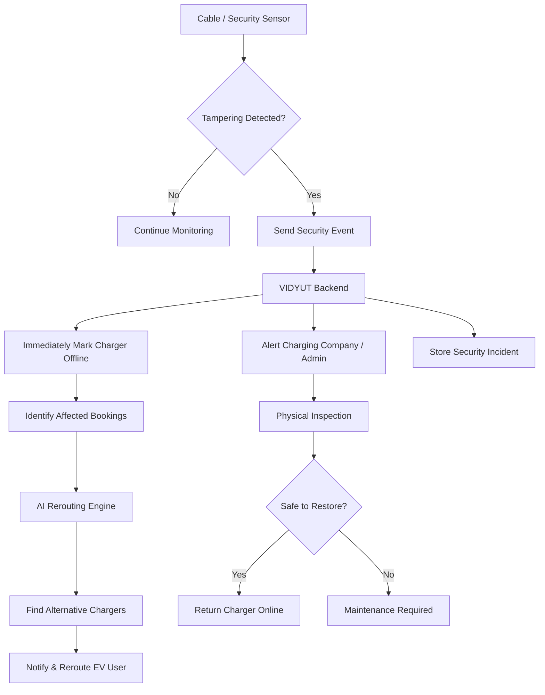
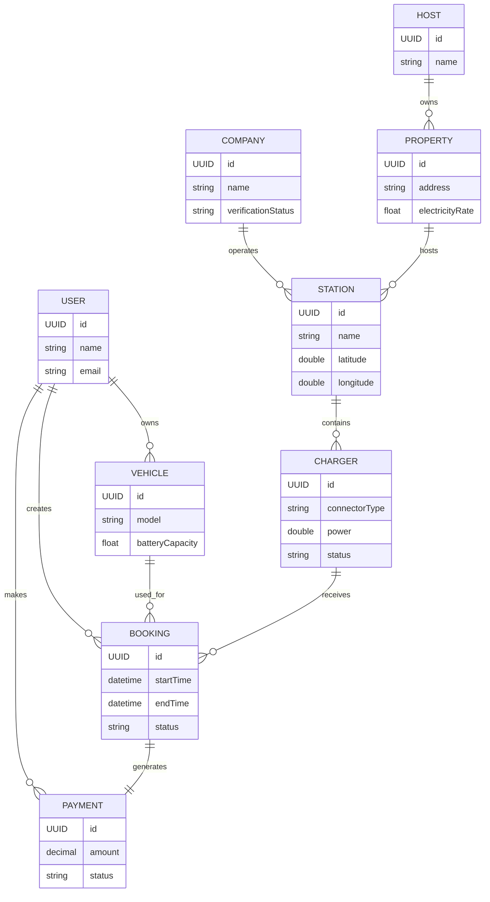

# 📚 Vidyut EV Charging Platform — Consolidated Documentation

> **Complete Master Documentation** combining all repository markdown guides, architecture manuals, subsystem breakdowns, release handoffs, and demo workflows into a single reference document.

---

## 📋 Table of Contents

1. [⚡ Platform Overview & Architecture (Root README)](#1-platform-overview--architecture)
2. [⚙️ Vidyut Backend API (vidyut-backend)](#2-vidyut-backend-api)
3. [💻 Vidyut Web Client (vidyut-web)](#3-vidyut-web-client)
4. [📱 Vidyut Mobile Client (vidyut-mobile)](#4-vidyut-mobile-client)
5. [🤖 Vidyut AI Autopilot Agent (vidyut-ai/agent)](#5-vidyut-ai-autopilot-agent)
6. [🎬 Interactive Demo Workflow & Verification](#6-interactive-demo-workflow--verification)

---

## 1. ⚡ Platform Overview & Architecture

*Source: [`README.md`](file:///c:/Users/Priyanshu%20Sharma/Desktop/app/ev_charger_app/README.md)*

### Overview
**Vidyut** connects EV drivers with peer-to-peer charging hosts, institutional station networks, and AI-powered trip planning intelligence. Designed as a full-stack platform, Vidyut addresses range anxiety, station availability bottlenecks, and charging infrastructure fragmentation through real-time telemetry, automated station diversion, and intelligent multi-stop trip optimization.

#### Key Capabilities
* 🚗 **AI Autopilot Trip Planner**: Real-time multi-stop EV route optimization, automatic battery range ring projection, one-tap station diversion with fee-free transfers, and proactive replanning.
* ⚡ **Peer-to-Peer & Institutional Marketplace**: Monetize personal charging outlets or institutional hubs (e.g., universities, corporate campuses) with tiered pricing (Faculty/Student/Visitor).
* 📡 **Direct Charger Telemetry via BLE**: Real-time 30-second State of Charge (SoC) synchronization over Bluetooth Low Energy with live session controls and telemetry validation.
* 🔐 **Secure & Partitioned Architecture**: PostgreSQL-enforced role partition model (Individual EV/Host accounts vs. Company and Admin accounts) with mode-scoped JWT session switching.
* 📲 **Cross-Platform Mobile & Web**: Modern React 19 web dashboard alongside a feature-packed React Native / Expo Router mobile experience with offline charging discovery and push notifications.

---

### 🏗️ Complete Architecture & System Workflows

#### 1. Overall System Architecture


---

#### 2. AI Agent Decision Flow


---

#### 3. Dynamic AI Charger Selection & Rerouting


---

#### 4. Property Owner & Charging Company Collaboration


---

#### 5. Charging Booking & Session Sequence


---

#### 6. Charger Hardware State Machine


---

#### 7. Tamper Detection & Security Response Workflow


---

#### 8. Role-Based Access Control (RBAC) Architecture

```mermaid
flowchart TB
    LOGIN["Authentication"]

    LOGIN --> USER["EV User"]
    LOGIN --> COMPANY["Charging Company"]
    LOGIN --> HOST["Property Owner"]
    LOGIN --> ADMIN["Administrator"]

    USER --> U1["Discover Chargers"]
    USER --> U2["Book Charging"]
    USER --> U3["Trip Planner"]
    USER --> U4["Wallet / Payments"]
    USER --> U5["Charging History"]

    COMPANY --> C1["Manage Chargers"]
    COMPANY --> C2["Manage Stations"]
    COMPANY --> C3["View Bookings"]
    COMPANY --> C4["Revenue Analytics"]
    COMPANY --> C5["Host Collaboration"]

    HOST --> H1["List Property"]
    HOST --> H2["Approve Installation"]
    HOST --> H3["Monitor Revenue"]
    HOST --> H4["Manage Locations"]

    ADMIN --> A1["Verify Companies"]
    ADMIN --> A2["Manage Users"]
    ADMIN --> A3["Security Monitoring"]
    ADMIN --> A4["Platform Analytics"]
    ADMIN --> A5["Dispute Management"]
```


---

#### 9. Entity Relationship Diagram (ERD)


---

### Subsystem Breakdown

| Module | Tech Stack | Description |
| :--- | :--- | :--- |
| **[vidyut-backend](file:///c:/Users/Priyanshu%20Sharma/Desktop/app/ev_charger_app/vidyut-backend)** | Spring Boot 3.3, Java 17, PostgreSQL, JPA/Hibernate, Flyway, JWT | Core REST API for user authentication, mode switching, charging sessions, wallet transactions, dynamic tier pricing, and station booking. |
| **[vidyut-web](file:///c:/Users/Priyanshu%20Sharma/Desktop/app/ev_charger_app/vidyut-web)** | React 19, TypeScript, Vite, Leaflet, Google Auth, Lucide | Responsive web dashboard featuring interactive map views, station management, account settings, and live trip previewing. |
| **[vidyut-mobile](file:///c:/Users/Priyanshu%20Sharma/Desktop/app/ev_charger_app/vidyut-mobile)** | React Native, Expo Router, TypeScript, BLE (`react-native-ble-plx`), TanStack Query, Zustand | Mobile app for iOS/Android with live BLE charger pairing, SoC telemetry sync, offline caching, push notifications, and QR scanning. |
| **[vidyut-ai/agent](file:///c:/Users/Priyanshu%20Sharma/Desktop/app/ev_charger_app/vidyut-ai/agent)** | Python 3.10+, Google GenAI SDK, Google ADK, Gemini 3.5 Flash | AI Autopilot agent providing natural language trip routing, timing scores, stop swap suggestions, delay simulation, and automated multi-stop reservations. |

---

### Development Setup & Commands

#### Option A: One-Command Concurrent Launch ⚡
```powershell
npm run dev
```

#### Option B: Manual Service Startup 🛠️

##### 1. Backend API (`vidyut-backend`)
```powershell
cd vidyut-backend
$env:SPRING_DATASOURCE_PASSWORD = "your_postgres_password"
mvn spring-boot:run
```

##### 2. AI Autopilot Agent (`vidyut-ai/agent`)
```powershell
cd vidyut-ai\agent
.\.venv\Scripts\Activate.ps1
pip install -r requirements.txt
$env:GOOGLE_API_KEY = "your_gemini_api_key"
$env:VIDYUT_AGENT_MODEL = "gemini-3.5-flash"
$env:VIDYUT_BACKEND_BASE_URL = "http://localhost:8080"
python -m vidyut_agent
```

##### 3. Web Client (`vidyut-web`)
```powershell
cd vidyut-web
npm install
npm run dev
```

##### 4. Mobile App (`vidyut-mobile`)
```powershell
cd vidyut-mobile
npm install
npm run android
```

---

## 2. ⚙️ Vidyut Backend API

*Source: [`vidyut-backend/README.md`](file:///c:/Users/Priyanshu%20Sharma/Desktop/app/ev_charger_app/vidyut-backend/README.md)*

The backend uses one PostgreSQL-backed authentication system. Passwords are stored as BCrypt hashes in `accounts`; authorization is stored in `account_roles`.

### Account Partition

- `INDIVIDUAL` accounts have `ROLE_EV_USER`, `ROLE_HOST`, or both.
- `COMPANY` accounts have only `ROLE_COMPANY`.
- `ADMIN` accounts have only `ROLE_ADMIN`.
- EV, host, and company data lives in `ev_user_profiles`, `host_profiles`, and `companies` respectively.

JPA validates this model and a deferred PostgreSQL constraint trigger enforces it at transaction commit, including profile participation. A direct SQL attempt to mix a company role with an individual account is rejected by PostgreSQL.

### Mode-Scoped Login

`POST /api/auth/login` returns `allowedModes`, `activeMode`, and an access token scoped to one mode. A dual EV/host user switches with `POST /api/auth/switch-mode`; the backend issues a new token containing only the selected authority.

Protected API groups are `/api/ev/**`, `/api/host/**`, `/api/company/**`, and `/api/admin/**`. Ownership-sensitive endpoints derive the account ID from the verified JWT rather than accepting a client-provided user ID.

### Local Database Configuration
```powershell
$env:SPRING_DATASOURCE_PASSWORD = '<your PostgreSQL password>'
mvn spring-boot:run
```

Optional variables are `SPRING_DATASOURCE_URL`, `SPRING_DATASOURCE_USERNAME`, and `JWT_SECRET`. Production requires `JWT_SECRET`.

---

## 3. 💻 Vidyut Web Client

*Source: [`vidyut-web/README.md`](file:///c:/Users/Priyanshu%20Sharma/Desktop/app/ev_charger_app/vidyut-web/README.md)*

React + TypeScript + Vite client for the Vidyut EV charging platform.

```powershell
npm install
npm run dev
```

Set `VITE_API_BASE_URL` when the backend is not available at `http://localhost:8080/api`. See `.env.example`.

Validation commands:
```powershell
npm run build
npm run lint
```

---

## 4. 📱 Vidyut Mobile Client

*Source: [`vidyut-mobile/README.md`](file:///c:/Users/Priyanshu%20Sharma/Desktop/app/ev_charger_app/vidyut-mobile/README.md) & [`vidyut-mobile/AGENTS.md`](file:///c:/Users/Priyanshu%20Sharma/Desktop/app/ev_charger_app/vidyut-mobile/AGENTS.md)*

React Native application for Android and iOS, managed with Expo SDK 57 and Expo Router.

```powershell
npm install
npm run android
```

Run `npm run ios` on macOS with Xcode. The default backend address is `http://10.0.2.2:8080/api` on Android emulators and `http://localhost:8080/api` on iOS simulators. Use `.env.example` when testing on a physical device.

Development builds use mock charger and booking data only when the backend cannot be reached. Authentication never falls back to mock credentials.

Validation:
```powershell
npm run typecheck
```

*Note on Expo Versioning*: Always consult Expo SDK 57 docs (`https://docs.expo.dev/versions/v57.0.0/`) when modifying mobile modules.

---

## 5. 🤖 Vidyut AI Autopilot Agent

*Source: [`vidyut-ai/agent/README.md`](file:///c:/Users/Priyanshu%20Sharma/Desktop/app/ev_charger_app/vidyut-ai/agent/README.md)*

This service runs Google ADK locally and uses the Gemini Developer API while Spring Boot remains responsible for authentication, authorization, and data. The user's bearer token is forwarded only to the Vidyut backend tools; it is never included in the Gemini prompt.

### Gemini Developer API Setup

1. Create an API key at <https://aistudio.google.com/app/apikey>.
2. Copy `vidyut_agent/.env.example` to `vidyut_agent/.env` if needed.
3. Put the key in the ignored `.env` file:

```env
GOOGLE_API_KEY=your-private-key
VIDYUT_AGENT_MODEL=gemini-3.5-flash
VIDYUT_BACKEND_BASE_URL=http://localhost:8080
```

4. Install and run from `vidyut-ai/agent`:

```powershell
.\.venv\Scripts\Activate.ps1
pip install -r requirements.txt
python -m vidyut_agent
```

The service listens on `http://127.0.0.1:8001`. Check `/health`, then send chat requests through Spring Boot at `POST /api/ev/agent/chat` so the verified Vidyut JWT is forwarded to the agent.

For ADK's development UI, run `adk web` from this directory. The `root_agent` uses the same Gemini model and tools.

### Vertex AI Migration Guide

Remove `GOOGLE_API_KEY` and configure standard Google Cloud environment variables:

```env
GOOGLE_GENAI_USE_VERTEXAI=TRUE
GOOGLE_CLOUD_PROJECT=your-project-id
GOOGLE_CLOUD_LOCATION=us-central1
VIDYUT_AGENT_MODEL=your-Vertex-supported-model-id
```

No Python tool or agent workflow changes are required.

---

## 6. 🎬 Interactive Demo Workflow & Verification

*Source: [`docs/demoworkflow.md`](file:///c:/Users/Priyanshu%20Sharma/Desktop/app/ev_charger_app/docs/demoworkflow.md)*

### Step-by-Step Demo Script

1. Start PostgreSQL, then run `npm run dev` from the repository root. Ports `8080`, `5173`, and `8001` must be free.
2. Open the EV Owner app and add/select the long-range demo vehicle. Use 80% SoC, Delhi → Mumbai, 15% arrival reserve, and the default 80% target.
3. Preview the agent plan. Confirm four timing-matched stops, open alternatives, swap one stop, and launch once to reserve every stop.
4. Start the trip, simulate a delay, confirm the replan/notification, complete each stop, then share the trip summary.
5. Open Map, enable `Outlet`, select the purple PSIT station, and verify Faculty ₹4/kWh, verified Student ₹6/kWh, and Visitor ₹9/kWh paths. The booking response must show the applied tier and rate.
6. Open Profile → Bluetooth & EV link. Enable simulator, pair the simulated Tata EV, enable session controls, start a charging session, and observe 30-second SoC updates.
7. Open Notifications to verify unread count, read/read-all, preferences, and deep-link navigation. Disable network access and confirm saved chargers remain visible while booking is blocked.

### Full System Verification Commands

```powershell
# Backend API & DB Tests
cd vidyut-backend
mvn test

# Mobile Typecheck & Bundle Check
cd ..\vidyut-mobile
npm run typecheck
npx expo config --type public
npx expo export --platform android --output-dir .expo-export-m5m10

# AI Agent Unit Tests
cd ..\vidyut-ai\agent
.venv\Scripts\python -m unittest discover -s tests -v

# Web Production Build
cd ..\..\vidyut-web
npm run build
```

*Note*: Delete the temporary `.expo-export-m5m10` folder after bundle verification.

---

### Production Deployment Requirements

- Add `extra.eas.projectId` and configure Android/iOS push credentials before enabling `vidyut.notifications.push-enabled=true`.
- Use an Expo development build for real BLE; Expo Go does not include `react-native-ble-plx`. Validate permissions and vehicle service contracts on physical hardware.
- Replace development ID-document URIs with authenticated object storage before production deployment.
- Run PostgreSQL Flyway migrations through `V9` in staging and test real push delivery, background behavior, and Bluetooth hardware.
